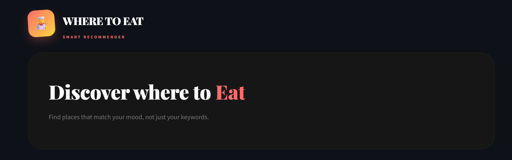

<p align="center">
  
</p>

Where to eat is a restaurant recommendation application that helps users discover **food businesses (restaurants, cafés, bars, and similar places)** based on categories or free-text descriptions.

---

## ✨ Features

* Explore restaurants by selecting **what you like** (categories, atmosphere, extras)
* Filter by **price range** and **city** for more precise recommendations
* View detailed restaurant **attributes** (amenities, services) with one click
* Personalized recommendations using a **like-based feedback system**
* "More like this" suggestions after each interaction
* Clean and interactive Streamlit interface

---

## 🧠 How it works (simple explanation)

The system uses a **transformer-based text model** to understand both:

* restaurant descriptions
* user queries

It converts text into embeddings (numerical representations) and compares them to find the most relevant matches.

---

## 🚀 How to run the app

This project uses **uv** for dependency and environment management.

### 1. Install dependencies

```bash
uv sync
```

### 2. Launch the Streamlit app

```bash
uv run streamlit run src/Yelp_recommender/main.py
```

---

## ⚙️ Requirements

* Python 3.10+
* uv installed
* dataset included in the project structure

---

## 📌 Deployment note

A Docker configuration is not provided at the moment, as the current pipeline includes heavy preprocessing and evolving dependencies. Containerization may be added in a future iteration once the architecture is stabilized.

---

## 🔮 Future improvements

* deeper personalization based on user history
* performance optimization of embeddings and similarity search
* production-ready deployment setup
```